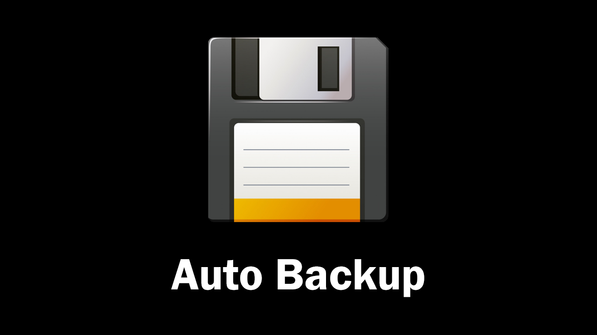
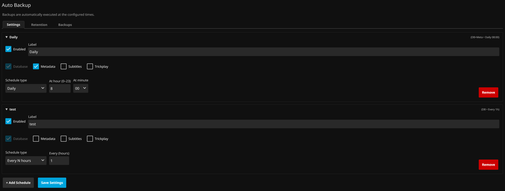
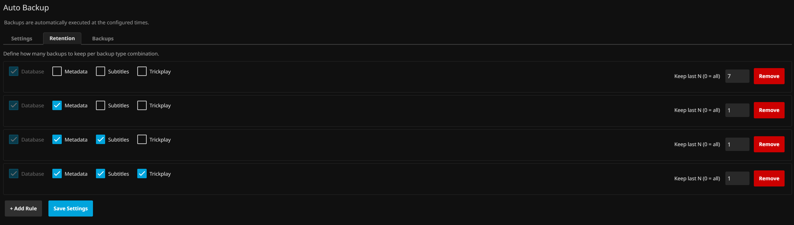
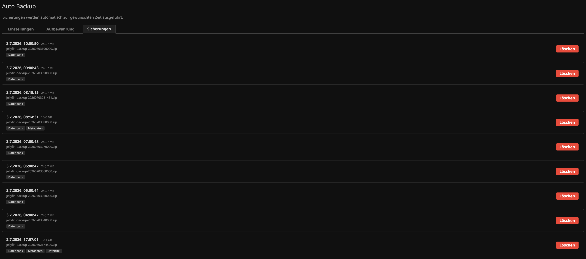

<p align="center">
  
</p>

# Auto Backup

A Jellyfin plugin that automatically creates scheduled backups of your Jellyfin data at the times you define.

## Features

- **Multiple schedules** — create as many independent backup schedules as you need
- **Flexible recurrence** — daily, weekly, every N hours/weeks, or monthly (fixed day or weekday)
- **Backup content selection** — choose what to include: Database, Metadata, Subtitles, Trickplay
- **Retention rules** — keep the last N backups per backup type combination, older ones are deleted automatically
- **Local server time** — schedule times are interpreted in the server's local timezone
- **Multilingual UI** — configuration page in English and German
- **Sidebar integration** — accessible directly from the Jellyfin sidebar under Plugins

## Requirements

| Plugin version | Jellyfin version | .NET |
|---|---|---|
| Built for `net9.0` | 10.11.x | .NET 9 |
| Built for `net10.0` | 12.0.x | .NET 10 |

## Installation

### Via Plugin Repository (recommended)

1. Open Jellyfin **Dashboard → Plugins → Repositories**
2. Add the following URL as a new repository:
   ```
   https://raw.githubusercontent.com/Filtik/Jellyfin-AutoBackup/main/manifest.json
   ```
3. Go to **Dashboard → Plugins → Catalog** and search for **Auto Backup**
4. Install and restart Jellyfin

### Manual

1. Download the ZIP for your Jellyfin version from the [Releases](https://github.com/Filtik/Jellyfin-AutoBackup/releases) page:
   - `Jellyfin-AutoBackup-*-10.11.x.zip` for Jellyfin 10.11.x
   - `Jellyfin-AutoBackup-*-12.0.x.zip` for Jellyfin 12.0.x
2. Extract the `Jellyfin.Plugin.AutoBackup.dll` from the ZIP
3. Place the DLL in your Jellyfin plugins folder (e.g. `/config/plugins/AutoBackup/`)
4. Restart Jellyfin

## Screenshots

| Schedules | Retention | Backups |
|:---------:|:---------:|:-------:|
|  |  |  |

## Configuration

After installation, open **Auto Backup** from the Jellyfin sidebar or via **Dashboard → Plugins**.

### Schedules tab
Each schedule has:
- **Label** — a name for the schedule
- **Enabled** toggle
- **Backup content** — Database (always included), Metadata, Subtitles, Trickplay
- **Schedule type** — Every N hours / Daily / Weekly / Every N weeks / Monthly (fixed day) / Monthly (weekday)
- **Time** — hour and minute (in 15-minute steps) at which the backup runs

### Retention tab
Define how many backups to keep per backup content combination. When a backup run finishes, older matching backups are deleted automatically. Leave a combination without a rule to keep all backups of that type.

### Backups tab
Lists all existing backups with their creation date, filename, and content badges. Backups can be deleted directly from this tab.

## License

This project is licensed under the [GNU General Public License v3.0](LICENSE).
